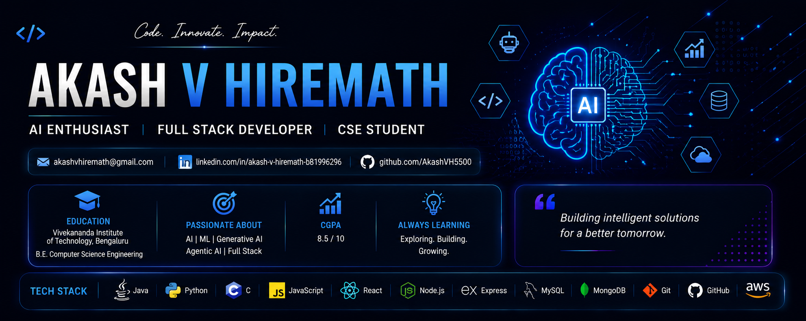

# Akash V Hiremath

### AI Enthusiast | Full Stack Developer | Computer Science Engineering Student

  

  

  

---

# 🚀 About Me

🎓 Final Year **Computer Science Engineering** student at **Vivekananda Institute of Technology, Bengaluru**

📊 **CGPA:** **8.5**

💡 Passionate about building intelligent software solutions using **Artificial Intelligence, Full Stack Development, and Cloud Technologies**.

### 🤖 Interests

* Artificial Intelligence
* Generative AI
* Agentic AI
* Multi-Agent Systems
* Full Stack Development
* Software Engineering
* Cybersecurity

### 🌱 Currently Learning

* Deep Learning
* Large Language Models (LLMs)
* System Design
* Advanced MERN Stack
* Cloud Computing

---

# 💻 Tech Stack

### Languages

* ☕ Java
* 🐍 Python
* 🌐 JavaScript
* 💻 C
* 🗄️ SQL

### Frontend

* HTML5
* CSS3
* React.js
* Bootstrap

### Backend

* Node.js
* Express.js
* FastAPI

### Database

* MongoDB
* MySQL
* PostgreSQL

### Tools

* Git
* GitHub
* Docker
* Postman
* Android Studio
* VS Code

---

# 🤖 AI / ML Interests

* Artificial Intelligence
* Machine Learning
* Generative AI
* Agentic AI
* Large Language Models (LLMs)
* Natural Language Processing
* Deep Learning
* Retrieval-Augmented Generation (RAG)

---

# 🚀 Featured Projects

## 🎓 College Assistant Chatbot

AI-powered chatbot built using **FastAPI**, **Streamlit**, and **LLMs** for answering college-related queries.

🔗 https://github.com/AkashVH5500/College-Assistant-Chatbot

---

## 🤖 AI Personal Learning Assistant

Multi-Agent AI learning platform developed using **Google ADK** and **Vertex AI** as part of the Google AI Agents Intensive Course.

🔗 https://github.com/AkashVH5500/ai-learning-assistant

---

## 🛡️ Malware Detection Platform

Distributed malware detection system using **FastAPI**, **Docker**, **RabbitMQ**, **PostgreSQL**, and Machine Learning.

🚧 Currently Under Development

---

## 🔍 Hoen Scanner

Python-based malware scanning microservice integrated with the Malware Detection Platform.

🔗 https://github.com/AkashVH5500/hoen-scanner

---

## ✈️ FlightApp

Android application developed using **Kotlin** and **Android Studio**.

🔗 https://github.com/AkashVH5500/FlightApp

---

## 💼 Portfolio Website

Responsive portfolio website showcasing projects, technical skills, and certifications.

🚧 Under Development

---

# 🏆 Certifications

✅ Google AI Agents Intensive Course

✅ Kaggle AI Agents Capstone

✅ IBM AI Fundamentals

✅ IBM SkillsBuild Customer Engagement

✅ HackerRank Python (Basic)

✅ HackerRank R (Basic)

✅ Google Cybersecurity

---

# 📈 GitHub Analytics

---

# 🔥 GitHub Streak

---

# 📊 Contribution Graph

---

# 🎯 Current Focus

### 📚 Learning

* Deep Learning
* Large Language Models (LLMs)
* Agentic AI & Multi-Agent Systems
* System Design
* Cloud Computing

### 🚀 Building

* Malware Detection Platform
* Personal Portfolio Website
* Full Stack Web Applications
* AI-Powered Developer Tools

### 🔬 Exploring

* Retrieval-Augmented Generation (RAG)
* Google ADK & AI Agent Frameworks
* Docker & Distributed Systems
* Cloud-Native Development
* AI for Cybersecurity

---

# 🌐 Connect

📧 **Email:** [akashvhiremath@gmail.com](mailto:akashvhiremath@gmail.com)

💼 **LinkedIn:**
https://www.linkedin.com/in/akash-v-hiremath-b81996296/

💻 **GitHub:**
https://github.com/AkashVH5500

---

### ⭐ Always Learning • Always Building • Always Improving

